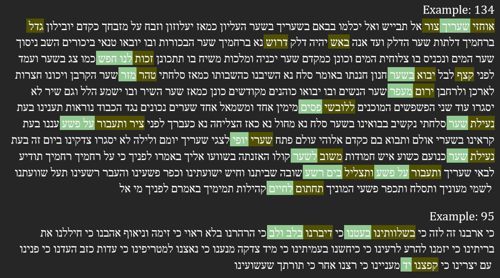
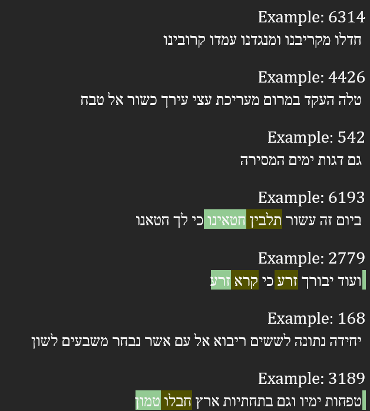
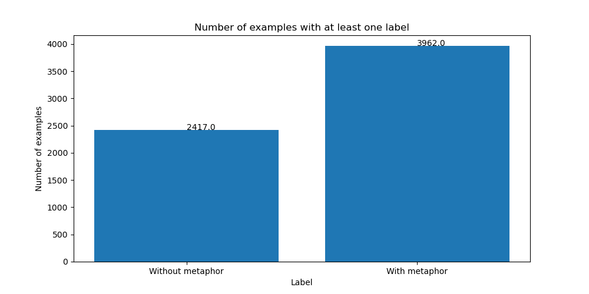
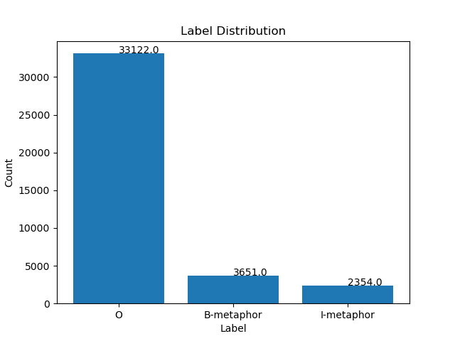
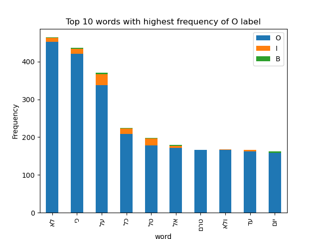
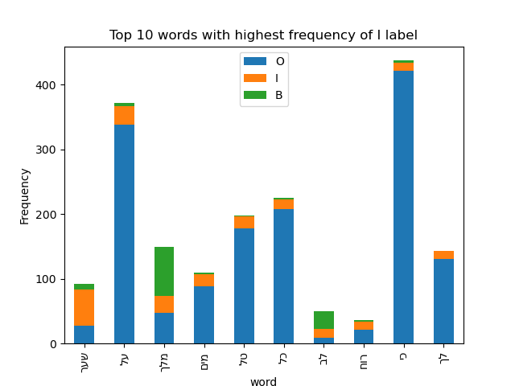
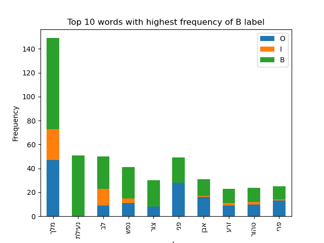

# NLP-Project-Understanding-Figurative-Language-Hebrew

In this project we aim to predicr metaphors from Hebrew Songs.

Data:
187 labeled texts in Hebrew (songs)

Data exploration:

Examples:

We split the data into rows (So we can insert the entire example into AlephBERT while fine-tuning)

We can see from the graph bellow that most of the rows has at least one metaphore.

We can see from the graph bellow that the data is imbalanced.

The following graphs show the most frequent words with each label:

